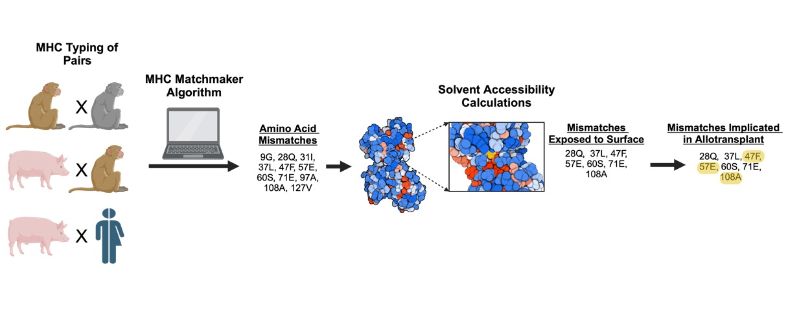
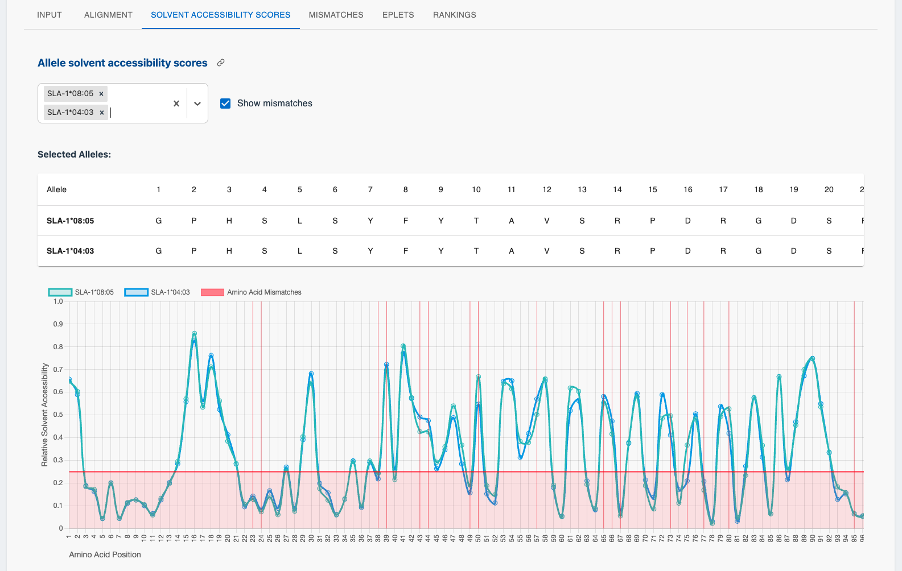

# MHC Matchmaker
<p align="center">
  
  <br>
  <em>Figure 1: Overview of the MHC Matchmaker Algorithm</em>
</p>

This repository contains the code for the MHC Matchmaker algorithm and web application. Our MHC Matchmaker algorithm is based on a curated database of all available Pig, Rhesus Macaques, Crab-eating Macaques and Human amino acid MHC sequences in the IMGT database (accessed September 1st, 2024). These sequences are aligned against a common consensus and the relative solvent accessibility score is calculated using the NetSurfP-3.0 model to compare and collate amino acid differences. 

<p align="center">
  
  <br>
  <em>Figure 2: Screenshot of the MHC Matchmaker web application interface</em>
</p>

## Demo version

A demo version of the web application is available at : [MHCMatchmaker](https://mhcmatchmaker.com).  
The demo version can be used to experiment with MHC Matchmaker but is limited in the amount of donor and recipient pairs it can process.  
In the case you need to analyze a larger amount of matchings, you can use the local version of MHC Matchmaker.  

## Using MHC Matchmaker locally

**Download database:**
1. Download the MHC database from: [**📥 Download Data (ZIP)**](https://github.com/debienicolas/mhcmatchmaker/releases/latest/download/mhc-data.zip)
2. Extract the contents to the root directory of this repository
3. Ensure the `data/` folder is in the same directory as `Dockerfile`

Once the database has been downloaded, 

### Local setup

1. (Recommended) Create a new conda environment or python virtual environment:
```
  # Creating and activating new conda env
  conda create --name ENV_NAME python=3.9
  conda activate ENV_NAME

  # Creating and activating new python virtual environment
  python3 -m venv ENV_NAME
  source ENV_NAME/bin/activate
```

2. Install the required dependencies:
```
  pip install -r requirements.txt
```

3. Build the frontend:
```
  cd frontend
  npm install
  npm run build
```

4. Launch the application:
```
  python api.py
```
You can now navigate to http://localhost:8000 to access the MHC Matchmaker webapplication. 

### Using Docker

1. Build the Docker image
   ```
   docker build -t mhcmatchmaker .
   ```

2. Create a Docker container from the image
   ```
   docker run --name mhcmatchmaker-app -p 8000:8000 mhcmatchmaker
   ```

   The application should now be accessible locally at http://localhost:8000. If the 8000 port is already in use or your machine, use -p OTHER_PORT:8000 instead. 

### Using MHC Matchmaker programatically (without GUI)

For detailed examples of using MHC Matchmaker programmatically, see our tutorial notebook:

📓 [**Tutorial: Using MHC Matchmaker Programmatically**](examples/tutorial.ipynb)

This notebook demonstrates how to:
- Load the MHC database directly
- Perform matching calculations in Python
- Process donor-recipient pairs programmatically
- Export results to various formats


## Citation

If you use this code, please cite our [paper](https://www.amjtransplant.org/article/S1600-6135(25)03073-4/abstract):
```bibtex
@article{MHCMatchmaker,
  title = {{{MHC Matchmaker}}: {{An}} in Silico Based Algorithm to Analyze Cross-Species {{NHP}}, Pig, and Human {{MHC}} Compatibility on the Amino Acid Level},
  shorttitle = {{{MHC Matchmaker}}},
  author = {De Bie, Nicolas and Ladowski, Joseph M. and Chapman, Henry and Jackson, Annette M. and Rogers, Bruce W.},
  year = 2025,
  month = nov,
  journal = {American Journal of Transplantation},
  doi = {10.1016/j.ajt.2025.10.022},
  pmid = {41197874},
}
```
