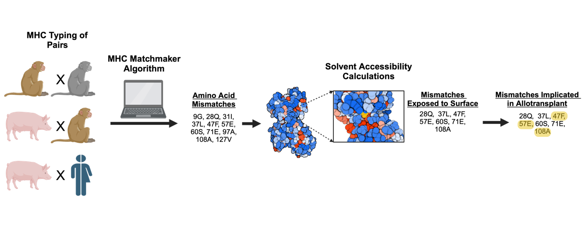
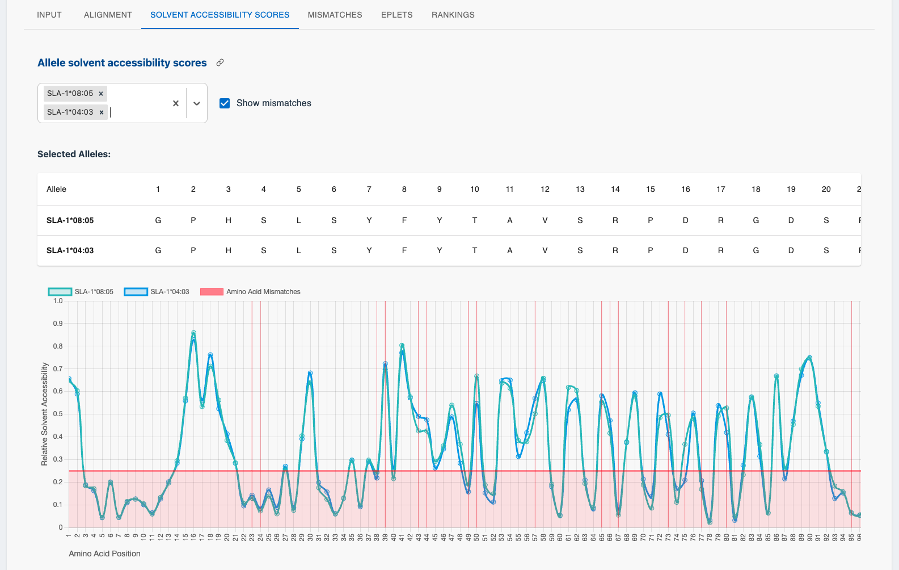

# MHCMatchmaker
<p align="center">
  
  <br>
  <em>Figure 1: Overview of the MHC Matchmaker Algorithm</em>
</p>

This repository contains the code for the MHC Matchmaker algorithm and web application. Our MHC Matchmaker algorithm is based on a curated database of all available Pig, Rhesus Macaques, Crab-eating Macaques and Human amino acid MHC sequences in the IMGT database (accessed September 1st, 2024). These sequences are aligned against a common consensus and the relative solvent accessibility score is calculated using the NetSurfP-3.0 model to compare and collate amino acid differences. 

<p align="center">
  
  <br>
  <em>Figure 2: Screenshot of the MHC Matchmaker web application interface</em>
</p>


## Running the application locally using Docker

1. Build the Docker image
   ```
   docker build -t mhcmatchmaker .
   ```

2. Run the container
   ```
   docker run -p 8000:8000 mhcmatchmaker
   ```

   The application should now be accessible locally at http://localhost:8000.

