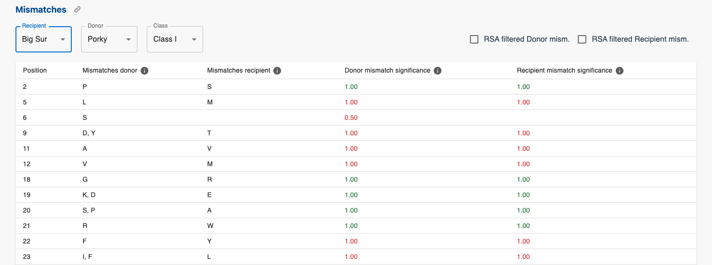

Worked out example
=======

This section will walk you through submitting and interpreting the results of an MHC-matchmaker analysis with the following input data:

| identifier | type      |                    |                        |                     |                        |                     |                        |                   |                  |
| ---------- | --------- | ------------------ | ---------------------- | ------------------- | ---------------------- | ------------------- | ---------------------- | ----------------- | ---------------- |
| Monterey   | Recipient | Mamu-A1\*004:01:02 | Mamu-DQA1\*01:04:01:01 | Mamu-DQA1\*01:05:03 | Mamu-DQB1\*06:01:01:01 | Mamu-DQB1\*06:02:02 | Mamu-DRB1\*03:09:01:01 | Mamu-DRB\*W002:01 | Mamu-B\*001:02   |
| Porky      | Donor     | SLA-1\*08:05       | SLA-3\*06:01           | SLA-DRB1\*06:01     | SLA-DQB1\*06:01        | SLA-DQA\*01:06      | SLA-DRA\*02:03:02      |                   |                  |
| Big Sur    | Recipient | Mamu-A1\*113:01    | Mamu-B\*015:04         | Mamu-DQA1\*26:01    | Mamu-DQA1\*26:03       | Mamu-DQB1\*15:01    | Mamu-DQB1\*15:03       | Mamu-DRB1\*03:03  | Mamu-DRB1\*07:01 |
| Pig 2      | Donor     | SLA-1\*04:03       | SLA-3\*03:08           | SLA-DRB1\*04:02     | SLA-DQB1\*02:09        | SLA-DQA\*02:07      | SLA-DRA\*02:03:01      |                   |                  |

### Submitting a job

The input data can be submitted in 2 ways:
- It can be uploaded as an excel or csv file. For specific details on the file format, check out the following [page](https://mhcmatchmaker-4875cb56efa5.herokuapp.com/input_instructions).
- Use the web app input interface to manually construct the input data.

Besides the input data, the relative solvent accessibility threshold can be set (default value is 0.25).

### Input data

Once the data is uploaded, the input data is validated.\
Multiple checks are performed:
- Check if the allele is present in the database [IPD](https://www.ebi.ac.uk/ipd) ([supported species](overview.md#input-data)):
    - If not, check if the allele name is a previous nomenclature (e.g. "A*0210" is a previous name for "A*02:10")
    - If not, check if we can shorten the allele name to a valid allele (e.g. "Mamu-A1*113:01:02" can be matched to "Mamu-A1*113:01")
- Check if the allele status is "public" (the [IPD](https://www.ebi.ac.uk/ipd) database status is not "abandoned")

In the figure below, the red box indicates that the "Mamu-A1*113:01" allele is not valid which leads to the allele being removed from the haplotype and not taken into account during the matching process.\
The blue box displays all the alleles that were replaced by other more recent or specific alleles.
These boxes only appear if there are invalid alleles or if replacements are relevant. 

## Results

When the job has finished running, the results are displayed in six tabs:
- [Input](#input)
- [Alignment](#alignment)
- [Solvent Accessibility scores](#solvent-accessibility-scores)
- [Mismatches](#mismatches)
- [Eplets](#eplets)
- [Rankings](#rankings)

### Input

The first tab displays the donors and recipients with their classified haplotypes.
If any changes were made to the input data, these have already been applied (e.g. invalid alleles removed).

### Alignment

The Alignment tab displays the individual aligned allele sequences per class.

One can display a selection of donors or recipients using the first dropdown menu.
The second dropdown menu allows to select which class to display.

The "Show mismatches w/ consensus" option highlights cells in red where the sequences differ from the consensus.

<em>Alignment Tab</em>

### Solvent Accessibility scores

The third tab displays an overview of the solvent accessibility scores for the donors and recipients.

The first section shows the relative solvent accessibility scores (RSA) for individual alleles.
The first table shows the amino acid sequences of the selected alleles.
The graph plots the RSA scores for each amino acid position with the red horizontal line denoting the RSA threshold set in the [input section](#submitting-a-job).

If multiple individual alleles are selected, the 'show mismatches' button can be enabled. 
This will color the cells of the mismatches between the selected alleles in red and plot red vertical lines on the RSA plot.

<em>RSA scores for individual alleles</em>

The second section displays the [grouped RSA score](overview.md#solvent-accessibility-scores) for the donors and recipients.\
The first dropdown menu allows to select which class to display.\
The second dropdown menu allows for donors and recipients to be selected.\
The horizontal red line is again the RSA threshold.

<em>RSA scores for donors and recipients</em>

### Mismatches

The mismatches tab goes into detail about the mismatches between donors and recipients.

The first 2 dropdown menus serve the purpose of selecting recipient and donor.
The third dropdown menu is for class selection.

<em>Mismatch tab</em>

The mismatch table consists of the following columns:
- Position: the position in the amino acid sequence
- Mismatches donor: the amino acids present in the donor alleles but not in the recipient alleles (for this specific position).
- Mismatches recipient: the amino acids present in the recipient alleles but not in the donor alleles (for this specific position).
- Donor mismatch significance: the [significance score](overview.md#mismatch-significance) of the donor mismatches.
- Recipient mismatch significance: the [significance score](overview.md#mismatch-significance) of the recipient mismatches.

For the Donor and Recipient mismatch significance columns, if the color of the score is:
- Red: the RSA value for that mismatch is lower than the threshold.
- Green: the RSA value for that mismatch is higher than the threshold.

If there is an empty donor mismatch cell, it means that there is no mismatch at that position, but there is a recipient mismatch in the next column (the same is true for empty recipient mismatch cells).

The two checkboxes at the top right are used to filter the mismatches by taking into account the RSA threshold.\
The following figure shows the RSA filtered donor mismatches.

<em>RSA filtered donor mismatches</em>

### Eplets

In this first section of the eplets tab, the recipient, the donor and class can be selected to display the eplets present in the mismatches.
The fourth dropdown menu is to select the type of mismatches to display (either donor or recipient mismatches).

**_NOTE:_** The mismatches used to identify the eplets are the unfiltered/initial mismatches.

See the [overview section](overview.md#identifying-known-eplets) for more information on how eplets are identified.\
The first column displays the identified eplet IDs and the second columns displays the donor alleles that have the mismatch and the eplet. The second column is necessary as not every donor allele has every grouped donor mismatch. The same is true for eplets.

<em>Mismatch eplets</em>

Below the table, a specific eplet can be selected which will display the relevant donor alleles with the eplet and mismatch cells highlighted.

<em>Selected eplet</em>

The second section displays all the eplets present in any selected individual allele.

<em>Eplets individual alleles</em>

### Rankings

With all the initial and filtered mismatches computed, the final tab displays the rankings based on 4 different criteria:
- The amount of donor mismatches
- The amount of recipient mismatches
- The amount of RSA filtered donor mismatches
- The amount of RSA filtered recipient mismatches

The rankings are done per class.

<em>Rankings tab</em>

### Download results

When downloading the results, a zip file is downloaded with 2 folders:
- results_csv: contains the results in csv format
- results_excel: contains the results in excel format

Each folder contains a file for every result tab in the web app. The key differences are:
- Excel files have seperate sheets for each class within a single file.
- CSV results are split into multiple files per tab if there are multiple classes. The class name is added to the file name.

<em>Download results</em>

