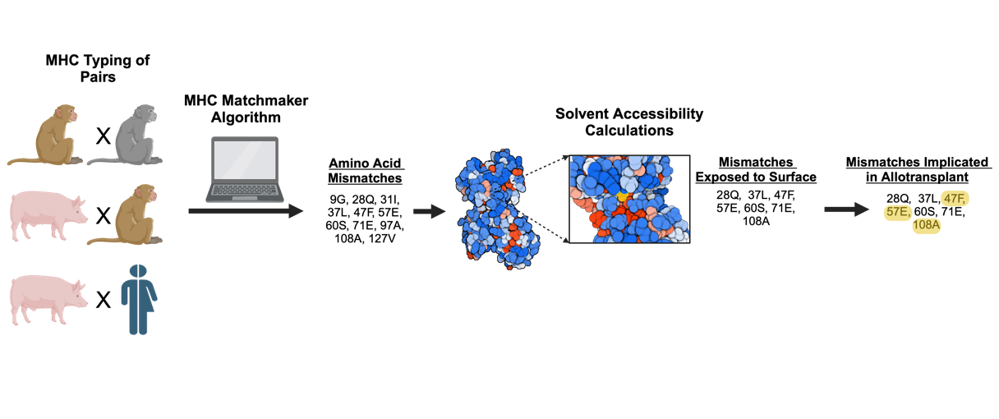

.. MHC-Matchmaker documentation master file, created by
   sphinx-quickstart on Fri Sep 27 18:54:58 2024.
   You can adapt this file completely to your liking, but it should at least
   contain the root `toctree` directive.

MHC-Matchmaker documentation
============================

Welcome to the MHC-Matchmaker documentation. 
This tool provides rankings for MHC compatibility between donors and recipients originating from different species.

.. toctree::
   :maxdepth: 2
   :caption: Contents:

   overview
   example
   

References
----------

.. bibliography::
   :style: plain
   :all:
